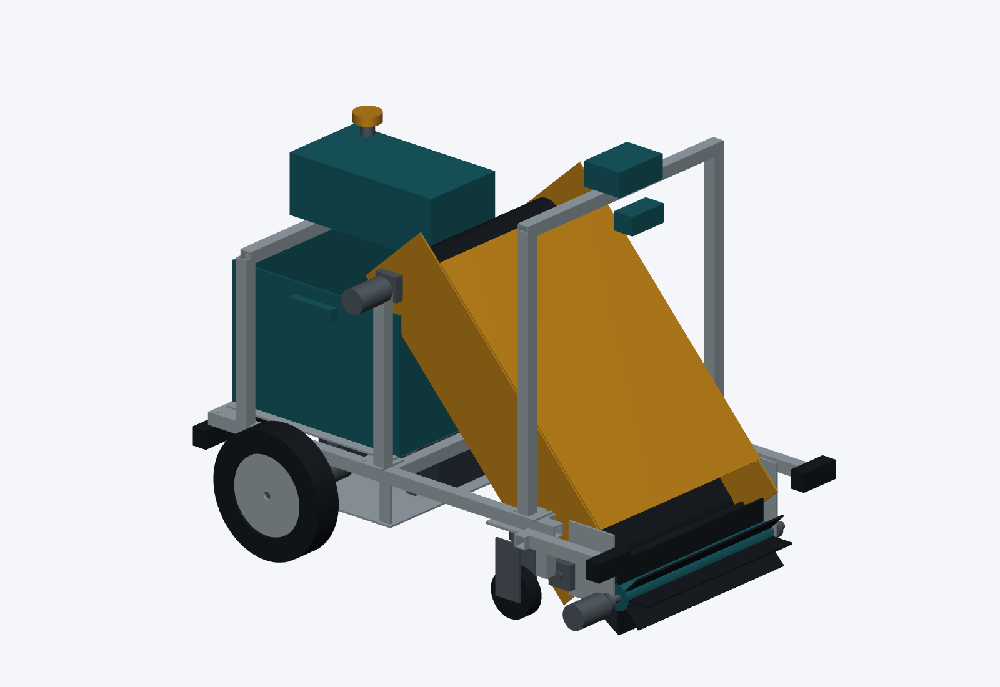

# wali — робот-сборщик мусора на Java

Подготовленная для GitHub версия **UBOR-JAVA R02 / WPILib**, предназначенная для `Eljah/wali`.
Имя репозитория — `wali`; существующие Java-пакеты `com.ubor`, Maven-координаты и имена CAD-файлов сохранены.

> Это инженерный прототип, не готовый к автономной эксплуатации робот. WPILib включён в исходники R02, но сборка и выполнение WPILib в исходной среде не были подтверждены. Наличие этого пакета не означает, что репозиторий уже создан на GitHub.



## Содержание

| Каталог | Материалы |
| --- | --- |
| `cad/` | Параметрические исходники, STEP, чертежи и спецификация механики. Нативных SolidWorks-файлов нет. |
| `electronics/` | Проект схем, перечень компонентов и соединений. |
| `software/` | Maven-проект: `robot-core`, `robot-app`, `robot-pi`, `robot-ml`, `robot-wpilib`. |
| `docs/` | Книга PDF/Markdown, глава о WPILib и инструкции. |
| `data/`, `models/` | Инструкции по данным и моделям; готовых обученных весов нет. |
| `verification/` | Сохранённые протоколы и ограничения проведённых проверок. |

## Сборка симулятора WPILib

Необходимы JDK 21, Maven 3.9+ и доступ к репозиториям зависимостей.

```bash
cd software
mvn -Pwpilib clean verify
```

Windows: `run-wpilib.cmd --desktop --nt`.
Linux: `./run-wpilib.sh --desktop --nt`.

Файл `software/dist/ubor-sim.jar` — проверенный **legacy-симулятор**, не готовая сборка WPILib.
Подробности: [README выпуска R02](README_RU.md) и [отчёт R02](verification/REPORT_R02_RU.md).
Автоматическая демонстрация использует известные сцене координаты и классы (`SIM_ORACLE_NOT_ML`), а не обученное машинное зрение.

## Документация

[Книга R02](docs/UBOR_JAVA_BOOK_R02.pdf) · [Глава WPILib](docs/25_WPILIB_R02.pdf) · [Сборка](docs/BUILD_RU.md).

## Создание репозитория

См. [PUBLISH_GITHUB_RU.md](PUBLISH_GITHUB_RU.md). Подготовлены `publish-github.ps1` и `publish-github.sh`.
По умолчанию они создают **приватный** `Eljah/wali`. Публикация требует входа в GitHub CLI на вашем компьютере.
Скрипты не заменяют существующий репозиторий и не используют force-push.
Исходные материалы R02 перенесены без изменения содержимого. Лицензия публикации автоматически не назначалась.
